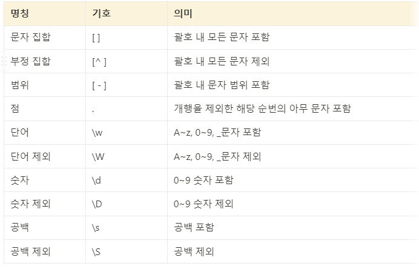
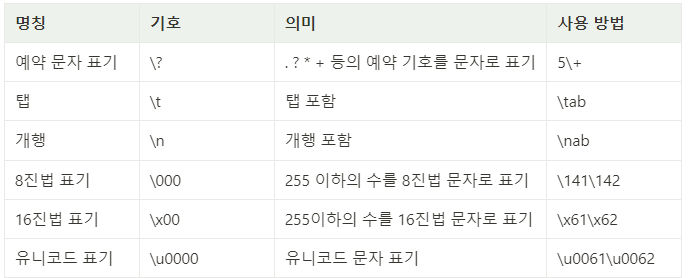
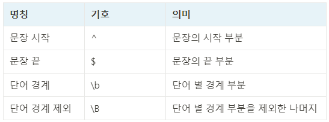
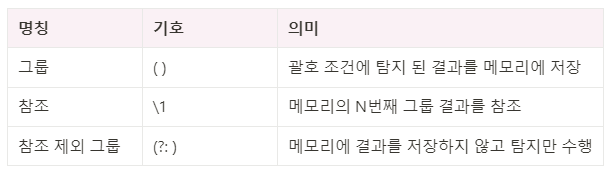
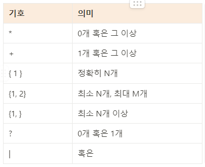
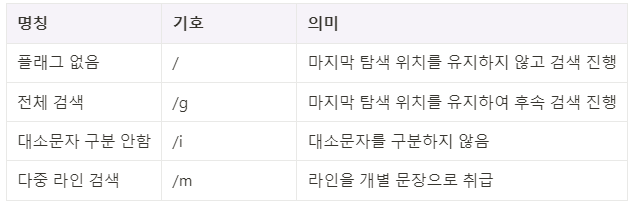

# 목차
[1. 문자표현](#문자표현)

[2. 이스케이프 문자표현](#이스케이프-문자표현)

[3. 앵커 표현](#앵커-표현)

[4. 그룹 표현](#그룹-표현)

[5. 수량자 표현](#수량자-표현)

[6. 플래그](#플래그)

# 문자 표현 

# 이스케이프 문자표현
이스케이프 문자를 사용하면 예약 문자, 특수 문자 및 유니코드 문자를 인식할 수 있다.  
이스케이프 문자는 모두 **역슬래시** 기호로 시작한다.

# 앵커 표현
앵커표현식은 탐색하고자 하는 대상의 위치를 지정할 때 사용된다.  

# 그룹 표현
그룹 표현식을 사용하면 그룹 내 문자를 결합하여 하나의 대상으로 인식할 수 있다. 

# 수량자 표현
지정된 횟수만큼 일치해야 함을 나타낸다. 

# 플래그 
플래그를 사용하여 정규표현식의 해석 방식을 변경할 수 있다. 
플래그는 정규표현식의 끝 부분에 작성되며, 여러가지 플래그를 동시에 사용할 수 있다.
  
